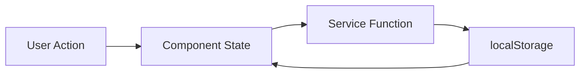

# 🚀 Solar System Explorer v2.4.1

An interactive **3D planetary database and mission control terminal** built with a modern frontend stack.  
Visualize the solar system in 3D, explore detailed planetary data enriched with live API sources, and manage space exploration missions with full **CRUD operations** stored locally in the browser.

---

## ✨ Features

### 🪐 Planetary Database
- Comprehensive data for all 8 planets
- Dynamic detail pages enriched with **NASA Solar System API**
- Atmospheric, orbital, and physical statistics
- Interactive UI with animated visualizations & fun facts

### 🛰 Mission Control Center
- Full CRUD: Create, view, edit, and delete missions
- Real-time updates stored locally using **localStorage**
- Async operations with simulated network delay
- Toast notifications & error handling

### 🌌 3D Solar System Visualization
- Built using **React Three Fiber** + **Three.js**
- Clickable planets & animated camera controls
- Real-time rendering using WebGL

### 🧠 Type-safe & Modern Development
- Fully typed with **TypeScript**
- Lightning-fast builds via **Vite**
- **Tailwind CSS** terminal-style UI theme
- Client-side routing via **React Router**

---

## 🏗 Tech Stack Overview

| Technology | Purpose |
|-----------|---------|
| **React 18** | UI library & component rendering |
| **TypeScript** | Type-safe JavaScript |
| **Vite** | Development server & bundler |
| **Tailwind CSS** | Utility-first styling |
| **React Three Fiber** | React renderer for Three.js 3D graphics |
| **React Router DOM** | Client-side routing |
| **Axios** | HTTP client for API calls |
| **localStorage** | Mission data persistence |
| **Sonner** | Toast notifications |

---

## 📁 Project Structure
├── components/ # UI components & 3D scenes
├── pages/ # Page-level views
├── services/ # API & localStorage logic
├── data/ # Static fallback planetary data
├── assets/ # Media / icons
├── App.tsx # App shell, routing config
└── main.tsx # Application entry file

---

## 🔧 Key Files Explained

### `src/App.tsx`
Handles app-wide providers and routing:
- BrowserRouter for navigation
- Setup for tooltips, queries, and toasts
- Defines URL → Component mapping

### `src/services/missionService.ts`
Acts as a **virtual JSON server** using `localStorage`:
- `getAllMissions`, `createMission`, `updateMission`, `deleteMission`
- Simulates latency with async `delay()` function
- No backend required—data persists locally

### `src/services/planetApi.ts`
Fetches real planetary stats:
- Calls external Solar System API
- Gracefully falls back to local data if request fails

### `src/components/SolarSystem3D.tsx`
Full WebGL 3D experience:
- `Canvas`, `mesh`, `OrbitControls`
- `useFrame()` for animation loops
- Click handlers for Planet Detail navigation

---

## 🧪 Mission CRUD Workflow



---

```
git clone https://github.com/your-username/solar-system-explorer.git
cd solar-system-explorer

